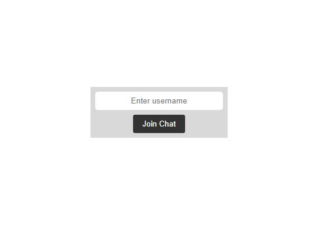
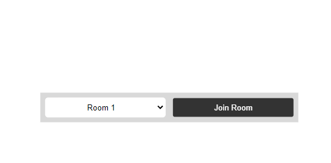
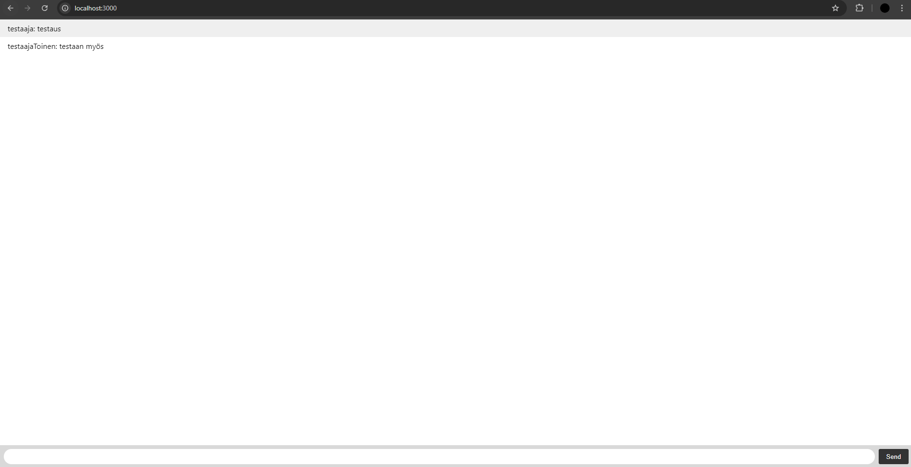

Chatin pohja tehty ohjeiden mukasesti mitä tehtävänannossa oli "get started" tutoriaalissa.

Käyttäjänimet lisäsin sillä tavalla. Että piilotin kokonaan chätin yms. ja aluksi tulee siis näkyviin vain tekstikenttä jossa kysytään käyttäjän nimeä.

Käyttäjänimen jälkeen tulee vielä huoneen valinta esiin, kuvassa on siis dropdown menu josta voi valita huoneen 1, 2 tai 3. (en saanu screenshottia snipping toolilla niin et se ois auki)

Lisäksi vielä kuva missä on laitettu viesti room 1 huoneeseen firefoxilla ja chromella

